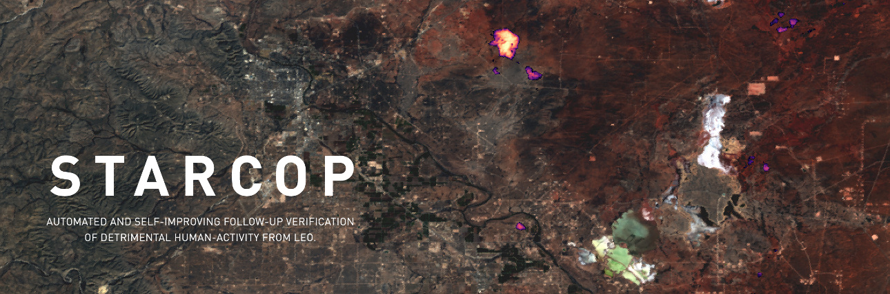

# STARCOP

<table>
<tr>
  <td width="100%"></td>
</tr>
<tr>
  <td>
    <b>The STARCOP system</b><br>
    <em>We introduce the STARCOP system, a lightweight model for methane plume detection in hyperspectral (AVIRIS-NG and EMIT) and multispectral (WorldView-3) data. We show that the proposed methods outperforms baseline approaches (ratio products for multispectral and matched filter approaches for hyperspectral data). Finally we release the full annotated training and evaluation dataset of methane plume events events. Project conducted as part of the ESA Cognitive Cloud Computing in Space (3CS) initiative with <a href="https://trillium.tech/starcop">Trillium Technologies</a>.
    </em>
</td>  
</tr></table>

<p align="center">
    
</p>

<p align="center">
  <a href="https://events.ecmwf.int/event/304/contributions/3628/attachments/2152/3811/ECMWf-ESA-ML_Ruzicka.pdf">presentation </a> and
  <a href="https://vimeo.com/771105606/c1cddccabb">video</a> from ECMWF–ESA workshop 2022 •
  <a href="https://colab.research.google.com/github/spaceml-org/STARCOP/blob/master/notebooks/model_demos_AVIRIS.ipynb">Quick Colab Demo with AVIRIS </a>
</p>


---

## Semantic Segmentation of Methane Plumes with Hyperspectral ML Models

> **Abstract:** Methane is the second most important greenhouse gas contributor to climate change; at the same time its reduction has been denoted as one of the fastest pathways to preventing temperature growth due to its short atmospheric lifetime. Detection of methane plumes in remote sensing data is possible, but the existing approaches exhibit high false positive rates and need manual intervention. Machine learning research in this area is limited due to the lack of large real-world annotated datasets. In this work, we are publicly releasing a machine learning ready dataset with manually refined annotation of methane plumes. We present labelled hyperspectral data from the AVIRIS-NG sensor and provide simulated multispectral WorldView-3 views of the same data to allow for model benchmarking across airborne and satellite sensors. We propose sensor agnostic machine learning architectures, using classical methane enhancement products as input features. Our HyperSTARCOP model outperforms the matched filter baseline, while reducing its false positive rate per classified tile. Additionally, we demonstrate zero-shot generalisation of our trained model on data from the EMIT hyperspectral instrument, despite the differences in the spectral and spatial resolution between the two sensors.


### Dataset

The full annotated dataset used for training and evaluation will be hosted on Zenodo. For easier access to the data for the demos, a smaller subsets are also hosted on Google Drive: <a href="https://drive.google.com/uc?id=1TwtSVpbvGd-lWfIjQrw0i4LqkiX2EuHq">evaluation dataset</a> and <a href="https://drive.google.com/uc?id=1C4ZHvT1ZPKVMFGmqcV12Aozs8Uv_DIxD">subset of the training dataset, including only strong plumes</a>. 
We provide selected AVIRIS hyperspectral bands, computed methane enhancement products and simulated multispectral views of the data from WorldView-3. For more details see the paper.

For dataset inspection use the prepared <a href="https://colab.research.google.com/github/spaceml-org/STARCOP/blob/master/notebooks/dataset_exploration.ipynb">Colab Dataset Exploration demo </a>.


### Code examples

**Install**

```bash
git clone git@github.com:spaceml-org/STARCOP.git

# This will create a starcop conda environment:
conda create -c conda-forge -n starcop python=3 ipython rasterio geopandas ipykernel matplotlib scikit-image mamba --y
source activate starcop

# Install georeader from: https://github.com/spaceml-org/georeader
pip install git+https://github.com/spaceml-org/georeader.git

cd STARCOP
pip install -r requirements.txt
```

**Inference**

To start using our model for inference, you can check the demo with AVIRIS data in <a href="https://colab.research.google.com/github/spaceml-org/STARCOP/blob/master/notebooks/model_demos_AVIRIS.ipynb"> Colab Inference on AVIRIS </a>, or with EMIT data in <a href="https://colab.research.google.com/github/spaceml-org/STARCOP/blob/master/notebooks/model_demos_EMIT.ipynb"> Colab Inference on EMIT </a>. These download our annotated datasets and demonstrate the performance of our pre-trained models.

**Training**

To reproduce the same training process as reported in the paper, you will need to download the whole STARCOP dataset from Zenodo first, and prepare the coding environment.

```bash
# Check possible parameters with:
!python3 -m scripts.train --help

# Or run the prepared training script used for the paper models (remember to download and adjust the paths to the training datasets)
./bash/bash_train_example.sh
```

## Citation
If you find the STARCOP models or dataset useful in your research, please consider citing our work. 
In the meanwhile, you can refer to the presentation from the 14-17 November during the ECMWF–ESA workshop 2022 (links above).

