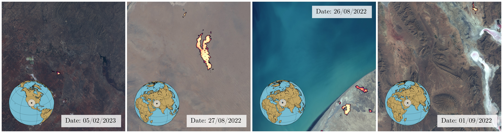
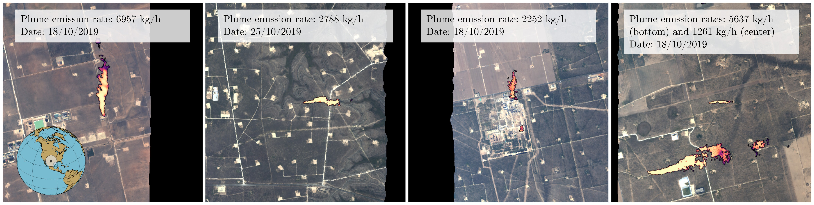

# STARCOP

<table>
<tr>
  <td width="100%"></td>
</tr>
<tr>
  <td>
    <b>The STARCOP system</b><br>
    <em>We introduce the STARCOP system, a lightweight model for methane plume detection in hyperspectral (AVIRIS-NG and EMIT) and multispectral (WorldView-3) data. We show that the proposed methods outperforms baseline approaches (ratio products for multispectral and matched filter approaches for hyperspectral data). Finally we release the full annotated training and evaluation dataset of methane plume events events. Project conducted as part of the ESA Cognitive Cloud Computing in Space (3CS) initiative with <a href="https://trillium.tech/starcop">Trillium Technologies</a>.
    </em>
</td>  
</tr></table>

<p align="center">
    
</p>

<p align="center">
  <a href="https://www.nature.com/articles/s41598-023-44918-6">Nature Scientific Reports Paper 2023</a> •
  <a href="https://www.cs.ox.ac.uk/news/2218-full.html">Oxford Department of Computer Science news</a>
</p>

<p align="center">
  <a href="https://events.ecmwf.int/event/304/contributions/3628/attachments/2152/3811/ECMWf-ESA-ML_Ruzicka.pdf">slides </a> &
  <a href="https://vimeo.com/771105606/c1cddccabb">video</a> from ECMWF–ESA workshop 2022 •
  <a href="https://colab.research.google.com/github/spaceml-org/STARCOP/blob/master/notebooks/model_demos_AVIRIS.ipynb">Quick Demo with AVIRIS </a> •
  <a href="https://huggingface.co/isp-uv-es/starcop"> Trained models🤗 </a>
</p>

---

## Semantic Segmentation of Methane Plumes with Hyperspectral ML Models

<details>
  <summary><b>Abstract</b></summary>
Methane is the second most important greenhouse gas contributor to climate change; at the same time its reduction has been denoted as one of the fastest pathways to preventing temperature growth due to its short atmospheric lifetime. In particular, the mitigation of active point-sources associated with the fossil fuel industry has a strong and cost-effective mitigation potential. Detection of methane plumes in remote sensing data is possible, but the existing approaches exhibit high false positive rates and need manual intervention. Machine learning research in this area is limited due to the lack of large real-world annotated datasets. In this work, we are publicly releasing a machine learning ready dataset with manually refined annotation of methane plumes. We present labelled hyperspectral data from the AVIRIS-NG sensor and provide simulated multispectral WorldView-3 views of the same data to allow for model benchmarking across hyperspectral and multispectral sensors. We propose sensor agnostic machine learning architectures, using classical methane enhancement products as input features. Our HyperSTARCOP model outperforms strong matched filter baseline by over 25% in F1 score, while reducing its false positive rate per classified tile by over 41.83%. Additionally, we demonstrate zero-shot generalisation of our trained model on data from the EMIT hyperspectral instrument, despite the differences in the spectral and spatial resolution between the two sensors: in an annotated subset of EMIT images HyperSTARCOP achieves a 40% gain in F1 score over the baseline.
</details>


### Dataset

The full annotated dataset used for training and evaluation is <a href="https://doi.org/10.5281/zenodo.7863343">hosted on Zenodo</a>. For easier access to the data for the demos, a smaller subsets are also hosted on Google Drive: <a href="https://drive.google.com/uc?id=1TwtSVpbvGd-lWfIjQrw0i4LqkiX2EuHq">evaluation dataset</a> and <a href="https://drive.google.com/uc?id=1C4ZHvT1ZPKVMFGmqcV12Aozs8Uv_DIxD">subset of the training dataset, including only strong plumes</a>. 
We provide selected AVIRIS-NG hyperspectral bands, computed methane enhancement products and simulated multispectral views of the data from WorldView-3. For more details see the paper.

**All bands:** If you'd like to use more AVIRIS-NG bands, please contact us for instructions on downloading the full data (a preview of the formatting in a mini dataset is also available <a href="https://huggingface.co/datasets/previtus/starcop_allbands_mini">here</a>).

For dataset inspection use the prepared <a href="https://colab.research.google.com/github/spaceml-org/STARCOP/blob/master/notebooks/dataset_exploration.ipynb">Colab Dataset Exploration demo </a>.


### Code examples

**Install**

```bash
conda create -c conda-forge -n starcop_env python=3.10 mamba
conda activate starcop_env

pip install git+https://github.com/spaceml-org/STARCOP.git
```

**Inference**

To start using our model for inference, you can check the demo with AVIRIS data in <a href="https://colab.research.google.com/github/spaceml-org/STARCOP/blob/master/notebooks/model_demos_AVIRIS.ipynb"> Colab Inference on AVIRIS </a>, or with EMIT data in <a href="https://colab.research.google.com/github/spaceml-org/STARCOP/blob/master/notebooks/inference_on_raw_EMIT_nc_file.ipynb"> Colab Inference on EMIT </a>. These download our annotated datasets and demonstrate the performance of our pre-trained models.

<table>
<tr>
  <td width="100%"><br>
  Selected predictions of our model detecting methane leaks using the data from the EMIT sensor deployed on board of the International Space Station. Showing detections from around the world with data from 2022-2023. Image credit: Open source EMIT data (NASA) processed by Vít Růžička.
  </td>
</tr>
<tr>
  <td width="100%"><br>
  Selected predictions of our model detecting methane leaks using the data from the AVIRIS aerial mission flown above the Four Corners area in the USA in 2019. Plume emission rates are used from the source annotations. Image credit: Open source AVIRIS data (NASA) processed by Vít Růžička.
  </td>
</tr>
</table>

Our trained models are stored in Hugging Face🤗 at [isp-uv-es/starcop](https://huggingface.co/isp-uv-es/starcop).

**Training**

To reproduce the same training process as reported in the paper, you will need to download the whole STARCOP dataset from Zenodo first, and prepare the coding environment.

```bash
# Check possible parameters with:
!python3 -m scripts.train --help

# Or run the prepared training script used for the paper models (remember to download and adjust the paths to the training datasets)
./bash/bash_train_example.sh
```

**Minimal training example**

If you install the environment using the commands above, this should work as a minimal training example (which includes first getting the data):

```bash
gdown https://drive.google.com/uc?id=1Qw96Drmk2jzBYSED0YPEUyuc2DnBechl -O STARCOP_mini.zip
unzip -q STARCOP_mini.zip
# The train script will expect the test dataset in the "test.csv" - so here in this small demo we just place the small subset there instead:
cp STARCOP_mini/test_mini10.csv STARCOP_mini/test.csv

python -m scripts.train dataset.input_products=["mag1c","TOA_AVIRIS_640nm","TOA_AVIRIS_550nm","TOA_AVIRIS_460nm"] model.model_type='unet_semseg' model.pos_weight=1 experiment_name="HyperSTARCOP_magic_rgb_DEMO" dataloader.num_workers=4 dataset.use_weight_loss=True training.val_check_interval=0.5 training.max_epochs=5 products_plot=["rgb_aviris","mag1c","label","pred","differences"] dataset.weight_sampling=True dataset.train_csv="train_mini10.csv" dataset.root_folder=PATH_TO/STARCOP_mini wandb.wandb_entity="YOUR_ENTITY" wandb.wandb_project="starcop_project"
```

## Citation
If you find the STARCOP models or dataset useful in your research, please consider citing our work. 

```
@article{ruzicka_starcop_2023,
	title = {Semantic segmentation of methane plumes with hyperspectral machine learning models},
	volume = {13},
	issn = {2045-2322},
	url = {https://www.nature.com/articles/s41598-023-44918-6},
	doi = {10.1038/s41598-023-44918-6},
	number = {1},
	journal = {Scientific Reports},
        author={Růžička, Vít and Mateo-Garcia, Gonzalo and G{\'o}mez-Chova, Luis and Vaughan, Anna and Guanter, Luis and Markham, Andrew},
	month = nov,
	year = {2023},
	pages = {19999}
}
```
## Acknowledgments

This research has been funded by ESA Cognitive Cloud Computing in Space initiative project number STARCOP I-2022-00380. It has been supported by the DEEPCLOUD project (PID2019-109026RB-I00) funded by the Spanish Ministry of Science and Innovation (MCIN/AEI/10.13039/501100011033) and the European Union (NextGenerationEU).
